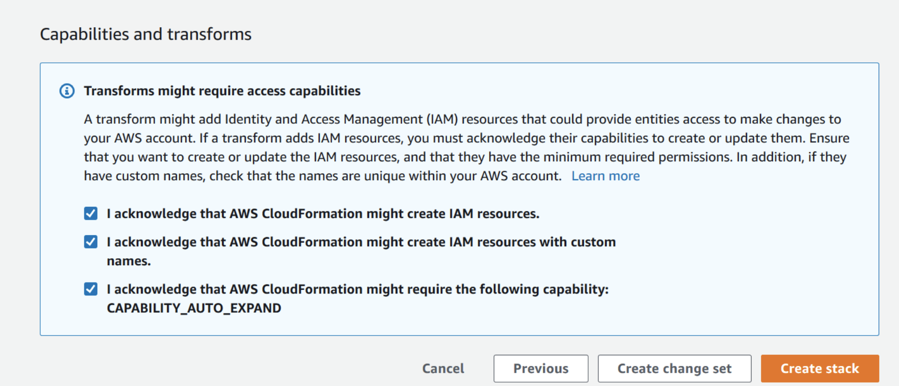

# Module 0: Deploying Amazon Neptune Cluster

Our goal in this module is to create a graph database, which will be used to provide food suggestions to the users of the mobile application. We will upload a sample dataset to this graph database in the later module.

For the graph database, we will use **Amazon Neptune**, a fast, reliable, and fully-managed graph database service that makes it easy to build and run applications that work with highly connected datasets.

## What will we build?


We will build following resources:
- Amazon Neptune Cluster in a private subnet within an Amazon Virtual Private Cloud (VPC)
- AWS Identity and Access Management (IAM) role to load the given dataset from an Amazon S3 bucket into the Amazon Neptune cluster. Loading data from an Amazon S3 bucket requires an IAM role that has permissions to access the S3 bucket. Amazon Neptune assumes this role in order to load the data.
- S3 bucket to copy the given dataset files to.
- An EC2 instance with Gremlin and Sparql clients installed. We will use Gremlin traversal language to query the graph.
- A *suggest-food-for-user* lambda function deployed in a VPC, which is used to provide food suggestions based on user activities and BMI.

We will use a CloudFormation template to create the above resources.

>Please note, for this workshop we will be using the **Ireland (eu-west-1)** region.

## Deploying the Cloudformation Stack

Use the following link to create the stack. 

Region| Launch
------|-----
eu-west-1 (Ireland) | [](https://eu-west-1.console.aws.amazon.com/cloudformation/home?region=eu-west-1#/stacks/new?stackName=reinvent-calorietracker-module0&templateURL=https://s3.eu-west-1.amazonaws.com/aws-appsync-calorie-tracker-workshop-master/0_NEPTUNE/templates/main.yaml)


 #### Deployment steps:
1. Provide a **Stack Name**, or use the default value.
2. Provide following parameter values under **EC2 Configuration** section and leave rest of the parameters with default values.
    - *Key pair name* - Specify an SSH key pair name.  Make sure you have the private key of this key pair, as you will need it to SSH into the instance, later. If you do not have it, please [create a new KeyPair](https://docs.aws.amazon.com/AWSEC2/latest/UserGuide/ec2-key-pairs.html#having-ec2-create-your-key-pair) from within EC2 console.
    - *S3 bucket name* - This needs to be globally unique.

    

3. Click next, twice. Under **Capabilities**, check the boxes and click **Create Stack** . 

    


   **It will take 15-20 mintues to complete the stack.**

4. Once the stack has been successfully deployed, the cloudformation **Output** section will provide the necessary information about the resources being created, as shown below:

    

> Please make a note of the following **Outputs** in a text editor, as we will be using it in the later modules of this workshop.
> - LoaderEndpoint
> - NeptuneLoadFromS3IAMRoleArn
> - S3Bucket

  You could also use the AWS CLI to fetch these details by running:

```bash
$ aws cloudformation describe-stacks --stack-name YOUR-STACK-NAME-HERE --query 'Stacks[0].Outputs'
``` 

---
**Congratulations!** You have successfully setup an Amazon Neptune cluster.

Next, we will be setting up the [AWS Cloud9 Development Environment](../1_AWS_Cloud9/README.md).

[Go back to the home page](../README.md)